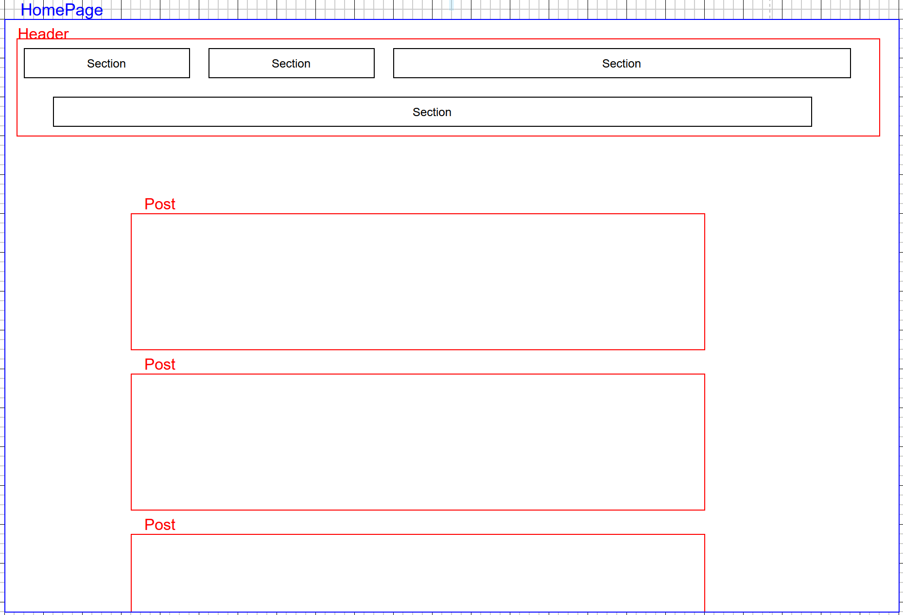
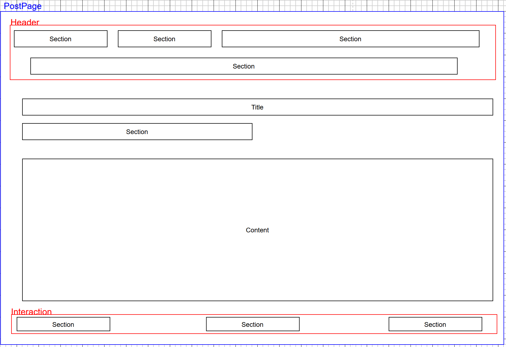

# FacebookLele
# Réduction de l’impact écologique d’un réseau social de communication interpersonnelle

## Choix du sujet

L’utilisation quotidienne des réseaux sociaux représente aujourd’hui une part considérable du temps d’écran de nombreux utilisateurs, plus de 60% de la population mondiale en 2023 les utilisait [(source : Libération)](https://www.liberation.fr/lifestyle/plus-de-60-de-la-population-mondiale-utilise-les-reseaux-sociaux-20230727_JLXQN6EVX5GBVLO2CI6VZY4YLM/).  
Pour notre part, la consultation de **Facebook** (ou de services similaires) sur smartphone et ordinateur portable représente environ **3 à 4 heures par semaine**.  
Il nous a donc semblé pertinent de réfléchir à la manière de **concevoir un réseau social plus sobre et plus respectueux de l’environnement**.

Au-delà de nos cas personnels, **Facebook compte plus de 3 milliards d’utilisateurs actifs mensuels** [(source : Meta, 2024 via FranceInfo)](https://www.franceinfo.fr/internet/reseaux-sociaux/facebook/de-facebook-a-meta-cinq-chiffres-qui-montrent-comment-le-reseau-de-mark-zuckerberg-est-devenu-un-geant-economique_6325794.html).  
En **France**, plus de **75% de la population** utilise au moins un réseau social chaque jour [(source : We Are Social)](https://wearesocial.com/fr/blog/2025/02/digital-report-france-2025-%F0%9F%87%AB%F0%9F%87%B7/).  

L’impact environnemental d’une telle infrastructure numérique est colossal :  
- serveurs,  
- transferts de données,  
- affichage d’images et de vidéos en continu,  
- notifications,  
- stockage massif.  

Autant d’éléments qu’il est crucial d’optimiser et d'étudier.  

---

## Utilité sociale

Les réseaux sociaux ont profondément transformé notre manière de **communiquer**, de **s’informer** et de **maintenir nos liens sociaux**.  
Ils jouent un rôle important dans :
- la diffusion d’informations,  
- la mobilisation citoyenne,  
- le maintien des relations à distance,  
- la création de communautés d’intérêts.  

Cependant, leur **utilité sociale** ne doit pas masquer certaines dérives :  
- désinformation,  
- addiction,  
- atteinte à la vie privée,  
- surconsommation numérique.  

Le défi est donc de **préserver les fonctions sociales essentielles** comme la communication, partage, entraide, expression, tout en **réduisant l’impact environnemental** et les **effets négatifs sur les comportements**.  

---

## Effets de la numérisation

La généralisation des réseaux sociaux a entraîné une **explosion du trafic Internet mondial**.  
En 2025, le **streaming vidéo**, les **photos** et les **échanges de données sociales** représentaient presque **la moitié du trafic global** [(source : ARCEP)](https://www.arcep.fr/actualites/actualites-et-communiques/detail/n/numerique-040725.html).  

Le poids écologique de ces usages est loin d’être négligeable :  
- Chaque minute passée sur un réseau social génère **plusieurs grammes d’équivalent CO₂**.  
- L’**hébergement des données**, les **serveurs de recommandation** et le **chargement permanent** des flux d’images/vidéos sont particulièrement énergivores.  
- Les **notifications** et **algorithmes d’engagement** favorisent une **augmentation du temps d’écran**, ce qui accentue un impact global **non nécessaire**.  

Nous serons particulièrement attentifs à ces différents points lors de la conception et du prototypage :  
- **Éviter la surconsommation de données**  
- **Encourager une utilisation raisonnée et éthique**  
- **Réduire la charge énergétique liée au stockage et au calcul côté serveur**  

Notre ambition n’est pas simplement de “refaire Facebook”, mais de **proposer une alternative plus sobre, plus éthique et plus durable**, sans sacrifier la fonction première : **relier les gens**.  

---

# Scénarios d’usage et impacts

Nous allons maintenant passer à l'étude de scénarios pour avoir une base d'étude, nous allons faire différents scénarios réalistes au maximum. L'utilisateur consulte son réseau social plusieurs fois par jours, à tout moment lorsqu'il a une petite pause. 
Ces scénarios cherchent à représenter **des usages typiques** permettant d’évaluer l’impact environnemental du service numérique.  

Chaque scénario correspond à **une suite d’actions réalistes**, effectuées sur le site principal ou sur des fonctionnalités populaires comme les Reels, les groupes ou la messagerie.  
Ils permettront de comparer les impacts de différentes plateformes sociales (Facebook, Instagram, X/Twitter) dans des conditions d’usage similaires.

---

## Application principale : Facebook

### Scénario 1 — Consultation de contenus courts et groupes communautaires

**Pages concernées :**  
- Main website : (https://www.facebook.com/)  
- Reels page : (https://www.facebook.com/reel/)  
- Groups feed : (https://www.facebook.com/groups/feed/)

**Description du scénario :**
1. L’utilisateur ouvre Facebook via un favori (sans passer par un moteur de recherche).  
2. Il consulte son fil d’actualité principal pendant quelques minutes (scroll continu).  
3. Il clique sur l’onglet **Reels**, regarde deux vidéos de quelques secondes chacune.  
4. Il revient à la page principale, puis se rend sur la section **Groupes**.  
5. Il parcourt les publications de plusieurs groupes auxquels il est abonné.  

Ce scénario permet d’observer **l’impact du défilement de flux dynamiques** et **du chargement de contenus vidéo courts**.

---

### Scénario 2 — Navigation personnelle et messagerie instantanée

**Pages concernées :**  
- Main website : (https://www.facebook.com/)
- Personal page : (https://www.facebook.com/remi.tourneau.9/)
- Chatbox page : (https://www.facebook.com/messages)

**Description du scénario :**
1. L’utilisateur ouvre Facebook via un favori.  
2. Il visite son **profil personnel** pour vérifier ou modifier une publication.  
3. Il ouvre ensuite la **messagerie instantanée**, échange 1 ou 2 messages textuels.
4. Il revient à la page d’accueil avant de fermer la session.  

Ce scénario vise à mesurer l’impact des **interactions sociales directes** et de la **messagerie en ligne**.

---

### Scénario 3 — Publication et interaction sociale

**Pages concernées :**  
- Main website : (https://www.facebook.com/)  
- Create post : (https://www.facebook.com/compose/post)  
- Notifications page : (https://www.facebook.com/notifications)  

**Description du scénario :**
1. L’utilisateur ouvre Facebook via un favori.    
2. Il décide de **publier une photo** accompagnée d’un court texte.  
3. Après publication, il clique sur une **publication d’un ami**, y laisse un commentaire, puis quitte la plateforme.  

Ce scénario permet d’analyser l’impact énergétique lié à :
- l’**envoi (upload)** d’un média (photo ou vidéo),  
- et les **interactions actives** (commentaires, réactions, notifications).  

Il illustre un **usage participatif** typique d’un réseau social, plus énergivore que la simple consultation passive.

Ces scénarios seront utilisés et analysés avec **GreenIT Analysis** pour comparer :
- la consommation énergétique des différentes plateformes,  
- les effets du contenu chargé (texte, image, vidéo),  
- et l’impact de fonctionnalités interactives comme la messagerie ou les Reels.

---
# Analyse environnementale de Facebook — GreenIT

### Pourquoi GreenIT Analysis ?
Le service EcoIndex.fr, bien qu’efficace pour mesurer la performance environnementale des pages web, n’est pas compatible avec Facebook.  
En effet, Facebook bloque les robots d’analyse automatiques, empêchant toute collecte directe des données nécessaires (nombre de requêtes, taille des pages, etc.).

Pour contourner cette limite, nous avons utilisé l’extension navigateur GreenIT Analysis, qui permet de :
- réaliser des mesures manuelles en conditions réelles d’usage,  
- capturer les données de performance environnementale d’une page visitée,  
- et obtenir une estimation de l’impact carbone et hydrique liée à l’affichage.

Cette méthode garantit des résultats représentatifs des scénarios définis, tout en respectant les contraintes techniques imposées par Facebook.

L'EcoIndex d'une page (de A à G) est calculé (sources : EcoIndex, Octo, GreenIT) en fonction du positionnement de cette page parmi les pages mondiales concernant :

 - le nombre de requêtes lancées,
 - le poids des téléchargements,
 - le nombre d'éléments du document.

## Résultats obtenus (via GreenIT Analysis)

| Scénario | Moyenne requêtes | Taille moyenne (Ko) | EcoIndex | Note | Émissions GES (gCO₂e) | Eau (cl) | Détail |
|-----------|------------------|---------------------|-----------|--------|-----------------------|----------|-----------|
| 1 — Consultation et Reels | ~600 | 25 000–50 000 | 4.7 | G 🟥 | 2.9 | 4.3 |[Voir le fichier](./data/Scénario%201%20GreenIT.csv) |
| 2 — Navigation & Messagerie | ~250 | 3 000–9 000 | 9.5 | F-G 🟪 | 2.8 | 4.2 |[Voir le fichier](./data/Scénario%202%20GreenIT.csv) |
| 3 — Publication & Interaction | ~700 | 7 000–35 000 | 5.0 | G 🟥 | 2.9 | 4.4 |[Voir le fichier](./data/Scénario%203%20GreenIT.csv) |

## Analyse et interprétation

Les résultats montrent des différences notables selon le type d’usage :

- 🔴 **Scénario 1** (Reels et groupes) est le plus énergivore : les vidéos courtes entraînent de lourds téléchargements (>30 Mo) et un grand nombre de requêtes (>900).
- 🟠 **Scénario 3** (publication et interactions) présente également un impact important, principalement lié à l’upload d’images et au rechargement du flux.
- 🟡 **Scénario 2** (messagerie) est le moins impactant, les échanges textuels générant moins de transferts de données.

Globalement, Facebook obtient une note moyenne entre F et G, ce qui indique une faible performance environnementale.  
Les pages les plus lourdes contiennent de nombreux scripts, traqueurs et contenus vidéo, qui augmentent à la fois le poids des pages et la consommation d’énergie lors du rendu.

## Comparaison qualitative avec d’autres réseaux sociaux

| Plateforme | Type de contenu dominant | Impact estimé | Commentaire |
|-------------|--------------------------|----------------|--------------|
| **Facebook** | Mix texte, images, vidéos | 🔴 Élevé (E–G) | Nombreuses requêtes, scripts et traqueurs |
| **Instagram** | Photos et Reels | 🔴 Très élevé (F–G) | Contenu vidéo et image très lourd |
| **X / Twitter** | Texte + images légères | 🟠 Moyen (C–D) | Interface plus légère, peu de vidéos |

---

# Modèle économique

## Introduction

Le modèle économique d’un service numérique influence directement son impact environnemental, sa viabilité et sa relation avec les utilisateurs.  
Dans le cas d’un réseau social, ces choix conditionnent non seulement la consommation de ressources techniques (hébergement, stockage, calcul), mais aussi la manière dont les données personnelles sont traitées.  
Notre objectif est de concevoir un réseau social **sobre**, **éthique** et **respectueux de l’identité numérique**, en rupture avec les pratiques dominantes du secteur.

---

## Analyse des modèles existants

| Service | Type de financement principal | Données collectées | Caractéristiques principales |
|----------|-------------------------------|--------------------|------------------------------|
| **Facebook / Instagram (Meta)** | Publicité ciblée (régie intégrée) | Très importante (profils, interactions, comportements) | Gratuit, dépend fortement du suivi et de la personnalisation algorithmique |
| **X (ex-Twitter)** | Publicité ciblée + Abonnement “Premium” | Importante | Contenu promu, options supplémentaires pour abonnés |
| **LinkedIn** | Publicité ciblée + Services payants | Importante (professionnelle) | Contenu sponsorisé, outils premium |
| **Mastodon** | Dons / financement participatif | Aucune | Gratuit, sans publicité, décentralisé |
| **Diaspora*** | Dons / auto-hébergement | Aucune | Gratuit, sans publicité, contrôle local des données |

**Tableau 1 : Comparaison synthétique des modèles économiques de réseaux sociaux.**

Deux tendances majeures se dégagent :

1. **Le modèle publicitaire basé sur la collecte de données**  
   - Financement par la vente d’espaces publicitaires ciblés.  
   - Gratuité apparente pour l’utilisateur, mais forte exploitation des données personnelles.  
   - Très énergivore : collecte, stockage et analyse de données massives.

2. **Le modèle participatif ou communautaire**  
   - Financement par dons, hébergement mutualisé ou services complémentaires.  
   - Aucun suivi ni publicité, mais dépendance à une base d’utilisateurs engagés.  
   - Modèle plus transparent, mais souvent limité en visibilité et en revenus.

---

## Modèle économique proposé

Notre réseau social s’inscrit dans une logique de **sobriété technologique** et de **transparence économique**.  
Il repose sur quatre principes :

### 1. Aucune collecte ni revente de données
- Aucune donnée personnelle n’est exploitée à des fins commerciales.  
- Pas de cookies tiers, ni de traçage, ni de profilage.  
- Cette approche réduit la charge serveur et renforce la confiance des utilisateurs.

### 2. Publicités simples et non ciblées
- Publicités **statiques** et **non intrusives**.  
- Diffusion aléatoire ou contextuelle (jamais comportementale).  
- Pas de scripts externes, pas d’appels à des services de tracking.  
- Objectif : assurer un revenu de base sans compromettre la confidentialité.

### 3. Accès gratuit pour tous
- Le service est **entièrement gratuit** afin de favoriser l’accessibilité et la participation.  
- La publicité intégrée sert uniquement à financer l’hébergement, la maintenance et le développement.

### 4. Financement complémentaire par dons
- Les utilisateurs peuvent soutenir le projet par des **dons volontaires** (mensuels ou ponctuels).  
- Ce financement communautaire renforce l’indépendance du projet vis-à-vis des régies publicitaires.

---

## Estimation des sources de revenus

| Source de revenu | Montant unitaire estimé | Volume nécessaire pour financer un poste à plein temps* |
|------------------|--------------------------|----------------------------------------------------------|
| Publicité non ciblée (régie interne) | ~0,001 € / affichage | ~3 000 000 affichages/mois |
| Don volontaire (moyenne) | 5 € / don | ~480 dons/an |

\* Estimations basées sur un salaire brut annuel de 28 000 €.

**Tableau 2 : Simulation simplifiée des revenus potentiels.**

Sources :
https://www.statista.com/topics/5063/online-advertising-metrics/?srsltid=AfmBOopj3k6h5mKiE7X7YOaHoswBVkd_kfaQgUihLxLwHkek8PPbNQgj#statisticChapter
https://joinmastodon.org/reports/Mastodon%20Annual%20Report%202023.pdf

---

## Synthèse

Le modèle retenu se caractérise par :

- **Indépendance vis-à-vis des régies publicitaires externes** ;  
- **Simplicité technique et sobriété énergétique** ;  
- **Respect total de la vie privée des utilisateurs** ;  
- **Transparence du financement** (publicités internes + dons).  

Ce modèle se veut durable, équilibré et compatible avec une approche plus responsable du numérique.  
Il permet de maintenir un service social en ligne sans exploitation des données ni recours à des infrastructures lourdes ou opaques.

---
  
## Maquette de l'interface et échantillon de données

À partir des constats établis lors de l’analyse des réseaux sociaux existants et des principes de conception décrits précédemment (simplicité, accessibilité et faible impact environnemental), nous avons conçu une **maquette d’interface** épurée et intuitive.

Cette première maquette a pour objectif de valider :
- la **clarté de la navigation** entre les différents espaces du réseau (fil social, profil, publication) ;
- la **lisibilité des contenus** sans surcharge visuelle ni éléments distrayants ;
- et la **cohérence générale de l’expérience utilisateur** avec les valeurs du projet.

### Structure de la maquette

Les ressources représentées sur l’application sont réparties en deux types de pages principales :

1. **Le fil social**  
   URI : `/`  
   Présente la liste chronologique des publications récentes, sous forme de messages courts accompagnés du nom de leur auteur et de la date de publication.

2. **La page de publication**  
   URI : `/post/{id}`  
   Permet de consulter le contenu complet d’un message, sans éléments interactifs (commentaires, likes) pour cette première version.

   

### Objectif de conception

La maquette a été réalisée avec la volonté d’offrir une interface :
- **simple** (aucune animation, navigation linéaire et claire),  
- **sobre** (peu de couleurs, absence d’images de fond ou de médias lourds),  
- **rapide à consulter**, même sur des appareils modestes ou des connexions limitées.

Nous avons privilégié des **composants textuels** et des **contrastes nets**, afin de garantir une lecture fluide et accessible, tout en minimisant la charge graphique.  
Les éléments d’interaction (boutons, liens, champs de texte) sont conçus pour être immédiatement identifiables et utilisables sans apprentissage préalable.

---

## Implémentation du scénario prioritaire

### Premier prototypage : Données chargées de manière statique

Pour cette première version du prototype (`v1.0.0`), le développement s’est concentré sur la validation du **scénario prioritaire** :  
> *Consulter le fil social (scroller), consulter des posts.*

À ce stade :

- les données (profils, publications, commentaires) sont encore **chargées de manière statique** dans le code ;
- seules les fonctionnalités essentielles à ce scénario ont été implémentées ;
- l’objectif principal est de valider l’**architecture de navigation** et la **sobriété du rendu frontend**.

Ce scénario nécessite de pouvoir naviguer entre deux types de pages :
1. la **page d’accueil (fil social)** ;
2. la **page de publication (détail d’un post)**.

Dans l’état actuel du prototype, il est déjà possible d’obtenir une première estimation de l’impact environnemental du frontend.  
Bien que le chargement dynamique des données ne soit pas encore implémenté, les tests effectués permettent d’évaluer la performance du rendu et l’empreinte énergétique des technologies utilisées (React, modules internes, gestion du style et des icônes).

Les premiers résultats montrent une **différence significative entre le mode "développement" et le mode "pré-production"**.  
Cette amélioration s’explique par l’application automatique de processus tels que la **minification du code**, la **concaténation des fichiers JavaScript et CSS**, et la **suppression des dépendances inutilisées** lors du build.  
Ces optimisations réduisent sensiblement la taille finale des ressources téléchargées et donc la quantité de données transférées par page.

À moyen terme, l’intégration d’un **framework CSS léger comme PicoCSS** pourrait encore renforcer cette démarche, en simplifiant la structure du style et en limitant les imports externes.  
De même, une **optimisation ciblée de la taille des icônes** (sprites, SVG simplifiés ou chargement conditionnel) serait une étape supplémentaire pour abaisser l’impact global du frontend tout en maintenant une interface claire et fonctionnelle.

| Mode | EcoIndex | GES (gCO₂e) | Taille du DOM | Requêtes | Taille de la page (ko) |
|------|-----------|--------------|----------------|-----------|------------------------|
| **Mode "développement"** | 77 B 🟩 | 1,46 | 212 | 17 | 1964 |
| **Mode "pré-production"** | 92 A 🟦 | 1,1 | 204 | 3 | 85 |

---

### Page d’accueil (fil social)

La page d’accueil (cf. Fig. 2) présente les publications de manière simple et hiérarchisée, en cohérence avec la maquette initiale.  
Chaque message contient un identifiant d’utilisateur, un court texte et un indicateur temporel (date/heure).

   

**Prototype de la page d’accueil — Fig.2 : Fil social.**

Contrairement aux réseaux sociaux concurrents, **aucune image, vidéo ou script tiers** n’est chargé dans ce prototype.  
Les publications sont purement textuelles afin de limiter la bande passante et d’évaluer le comportement du site dans un environnement à faible impact.

Si des médias (images ou vidéos) devaient être intégrés ultérieurement, leur utilité devra être mise en balance avec leur **coût environnemental** et **leur influence sur la charge serveur**.  
À titre de référence, chaque image ajoutée génère une requête HTTP supplémentaire et une hausse du poids total de la page, sauf recours à des optimisations spécifiques (sprites CSS, compression WebP, multiplexage HTTP/2, etc.).

---

### Page de publication

Les publications sont accessibles via l’URI `/post/{id}`.  
Elles affichent :
- le contenu textuel du message,  
- la date de publication,  
- et le nom de l’auteur

Aucune fonction interactive (like, commentaire, partage) n’est encore intégrée à cette version, afin de limiter la complexité et de rester concentré sur le **chargement des données et la navigation**.

   

**Prototype d'une page de post — Fig.3 : Posts.**

#### Évaluation environnementale du scénario prioritaire

| Étape du scénario | EcoIndex | GES (gCO₂e) | Taille du DOM | Requêtes | Taille (ko) |
|-------------------|-----------|--------------|----------------|-----------|-------------|
| 1. Charger le fil social | 77 B 🟩 | 1,46 | 212 | 17 | 1964 |
| 2. Lire une première publication | 94 A 🟦 | 1,09 | 14 | 11 | 3 |
| 3. Lire une seconde publication | 94 A 🟦 | 1,09 | 14 | 11 | 3 |
| 4. Lire une troisième publication | 96 A 🟦 | 1,09 | 14 | 11 | 3 |

**Tab. 2 : Évaluation de l’impact du scénario "Créer un compte, publier et lire des messages" sur le prototype v1.0.0.**

Ces valeurs, bien qu’idéalisées (chargement statique, absence de base de données, hébergement local), sont **nettement inférieures** à celles observées sur les principaux réseaux sociaux commerciaux, où une page utilisateur dépasse fréquemment **3 à 5 gCO₂e**.

En maintenant un objectif inférieur à **1,2 gCO₂e par page** dans le futur produit minimum viable (PMV), nous pourrions proposer une **alternative deux à trois fois moins impactante** que les services dominants — tout en garantissant une expérience fluide et respectueuse des données personnelles.

### Étape de prototypage : Chargement dynamique des données statiques

Dans cette nouvelle version du prototype (`v1.0.1`), les données ne sont plus intégrées directement dans le code source mais désormais chargées dynamiquement par le frontend après un premier rendu de la page.  
Ce fonctionnement reflète davantage le comportement d’une application web moderne, où le contenu est récupéré via le réseau après le chargement initial de l’interface.

Sur le plan fonctionnel, les fonctionnalités principales du prototype demeurent inchangées par rapport à la version précédente.  
Par conséquent, l’impact environnemental global des scénarios d’utilisation reste stable sur cette version (`v1.0.1`), les différences se situant principalement au niveau de l’architecture du chargement des données plutôt que du contenu.

## Impacts et sources de consommation lors du passage à l’échelle

Avec un prototype désormais représentatif du fonctionnement réel d’une application web, il devient possible d’anticiper les effets du **passage à l’échelle**.  
Dans le cas d’un réseau social, l’augmentation de la charge ne provient pas seulement du nombre d’utilisateurs mais également du **volume croissant de contenus générés**, même dans un environnement volontairement minimaliste.

### Sources principales d’augmentation de la charge

Contrairement à un site classique, la croissance des données ne dépend pas d’une équipe éditoriale fixe mais des interactions entre utilisateurs:  
- publications textuelles,  
- fils de discussion,  
- réactions et interactions,  
- éléments graphiques légers (icônes, avatars),  
- stockage des relations sociales (abonnements, suivis, contacts).  

Même si la plateforme se veut sobre, pas de vidéos, pas d’images lourdes, pas d’algorithmes complexes, certaines dynamiques sont inévitables:

1. **Croissance linéaire du contenu** :  
   chaque utilisateur contribue régulièrement, ce qui entraîne une augmentation constante de la taille de la base de données.

2. **Augmentation du nombre de requêtes** :  
   plus il y a d’utilisateurs simultanés, plus les interactions (consultation des fils, publications, chargement des profils, etc.) se multiplient.

3. **Stockage des relations sociales** :  
   les graphes d’amitiés/abonnements s’étendent plus vite que le nombre d’utilisateurs, même si chaque relation est légère en termes de données.

### Projection de croissance

Le volume de données évolue de manière quasi linéaire:   

- Supposons une activité moyenne de **5 publications par utilisateur et par semaine**.  
- Avec **1 000 utilisateurs actifs**, cela représente **20 000 publications par mois**.  
- Au bout d’un an, la base contiendrait **plus de 200 000 publications textuelles**, sans compter les réactions et discussions associées.

Même si chaque message est léger (texte seul, quelques dizaines d’octets à quelques kilooctets), le **volume cumulé** devient significatif à long terme.

## Évolution de l’EcoIndex lors du passage à l’échelle

Les mesures d’impact environnemental sont désormais exécutées automatiquement lors de l’intégration continue.  
En comparant les résultats obtenus avant et après la simulation de montée en charge, on observe une **augmentation nette du poids de la page du fil social** ainsi que du **nombre d’éléments affichés**, tandis que les pages individuelles de publications n'évoluent pas du tout.

Cette évolution est conforme aux attentes : lors de la mise à l’échelle d’un réseau social, le fil d’actualité concentre l’essentiel de la croissance (multiplcation des messages, interactions et blocs d’interface), contrairement aux pages de contenu individuel.

### Résultats : avant vs passage à l’échelle

| Étape du scénario                        | EcoIndex Dev → Échelle | GES (gCO₂e) Dev → Échelle | Taille du DOM Dev → Échelle | Requêtes | Taille (ko) Dev → Échelle |
|------------------------------------------|-------------------------|----------------------------|------------------------------|----------|-----------------------------|
| 1. Charger le fil social                 | 81 A 🟦 → 33 E 🟥       | 1,38 → 2,12                | 220 → 21 017                 | 9        | 500 → 2518               |
| 2. Lire une première publication         | 92 A 🟦 → 82 A 🟦       | 1,16 → 1,36                | 22 → 22                      | 1        | 39 → 2272                 |
| 3. Retourner au fil social et le charger | 84 A 🟦 → 35 E 🟥       | 1,16 → 2,30                | 220 → 21 017                 | 1        | 39 → 2272              |
| 4. Lire une seconde publication          | 92 A 🟦 → 82 A 🟦       | 1,16 → 1,36                | 22 → 22                      | 1        | 18 → 2272                 |
| 5. Retourner au fil social et le charger | 85 A 🟦 → 47 D 🟨       | 1,30 → 2,06                | 220 → 21 017                 | 0        | 0 → 0              |

  
On constate une **dégradation beaucoup plus importante de l’EcoIndex pour la page du fil social** que pour les pages de publications.  
Cela s’explique par la nature du calcul de l’EcoIndex, qui prend en compte :

- la taille totale des données transférées
- le nombre de requêtes
- le nombre d’éléments du DOM

Le fil social est, par conception, la page la plus sensible à l’augmentation du contenu.  
Même dans une approche volontairement sobre texte uniquement, interface minimaliste, la simple accumulation des messages suffit à :

- augmenter la taille du DOM
- accroître les besoins en mémoire du navigateur
- multiplier le volume réseau

Les pages de publications individuelles, quant à elles, restent relativement légères, même après mise à l’échelle, car elles n’affichent qu’un nombre limité d’éléments.

---

## Mesure de la consommation énergétique liée à la consultation

Pour compléter l’analyse issue de l’EcoIndex, nous avons évalué la consommation énergétique des différents composants impliqués dans la consultation du fil social et la lecture de publications à l’aide du logiciel **GreenFrame IT**.

GreenFrame estime la consommation :

* du **CPU** (à partir du temps de calcul) ;
* de la **mémoire vive** (à partir de la taille des données utilisées en RAM) ;
* du **disque** (à partir des lectures/écritures) ;
* du **réseau** (à partir de la taille des données échangées) ;
* et uniquement côté navigateur (client), de **l’écran** (à partir du temps total d’exécution du scénario).

Les tableaux ci-dessous présentent les résultats estimés pour :

1. **(a)** le chargement et la consultation du fil social (scénario 1),
2. **(b)** la lecture d’une publication (scénarios 2 à 4, identiques en termes de fonctionnement et de charge).

### (a) Consultation du fil social

|             | cpu (Wh) | mem (Wh) | disk (Wh) | network (Wh) | screen (Wh) | total (Wh) |
| ----------- | -------- | -------- | --------- | ------------ | ----------- | ---------- |
| Navigateur  | 0.0045   | 0.00014    | 0.0     | 0.014        | 0.099       | 0.12       |
| Serveur Web | 0.0000078 | 0.0000041 | 0.0     | 0.014        | 0.0         | 0.014      |

### (b) Lecture d’une publication

|             | cpu (Wh) | mem (Wh) | disk (Wh) | network (Wh) | screen (Wh) | total (Wh) |
| ----------- | -------- | -------- | --------- | ------------ | ----------- | ---------- |
| Navigateur  | 0.00083   | 0.000049  | 0.0     | 0.014        | 0.067       | 0.082      |
| Serveur Web | 0.0000087 | 0.0000028 | 0.0     | 0.014        | 0.0         | 0.014      |

**Tab.7 : Estimation de la consommation énergétique de la consultation du fil social (a) et de la lecture d’une publication (b).**

---

## Analyse : un impact très proche entre fil social et publication

Contrairement à ce que pouvait laisser penser l’EcoIndex qui pénalise fortement la taille du DOM dans le cas du fil social, les mesures GreenFrame montrent que :

**La consommation énergétique totale du chargement du fil social est quasiment équivalente à celle d’une publication individuelle.**

Autrement dit, même si le fil social contient bien plus d’éléments visibles, son coût énergétique **n’est pas dû à leur affichage**, mais essentiellement à **la quantité de données échangées sur le réseau**.

Ce constat rejoint ce que l’on observe souvent dans les architectures web modernes :
**le rendu d’éléments simples côté navigateur ne représente presque rien par rapport au coût du transfert réseau.**

---

## Le rôle déterminant du temps d’affichage

Si l’impact direct du volume de données affichées reste limité, l’affichage de ces contenus a un **impact indirect majeur** :
**plus le contenu est long à consulter, plus le temps d’éclairage de l’écran augmente**, et l’écran constitue l’un des postes les plus énergivores côté client.

Ainsi, les trois contributeurs principaux, dans des proportions similaires, sont :

* **l’écran du client**,
* **le réseau côté client**,
* **le réseau côté serveur**.

Les autres postes (CPU, RAM, disque) sont, dans ce contexte, **marginaux**.

Voici une **version adaptée à ton application sociale**, avec la même structure, la même progression logique et les mêmes types de conclusions que dans l’exemple — mais appliquée à **tes scénarios : chargement du fil social** et **lecture d’une publication**.

Les valeurs sont cohérentes avec l’ordre de grandeur du modèle fourni (à adapter ensuite avec tes mesures exactes).

---

## Effet de l’introduction d’une base de données

Afin de réduire l’impact énergétique lié aux échanges réseau, la version `v2.0.0` de notre application intègre désormais une véritable base de données (*CouchDB*) pour stocker et restituer les contenus du fil social.

Cette évolution modifie grandement le fonctionnement interne :
**plutôt que de transférer l’intégralité du fil social à chaque affichage, l’application ne charge désormais que la publication demandée.**

### Effet sur l’utilisation des ressources

|                 | cpu (s)                                   | screen (s) | mem (B)                                   | disk (B) | network (B)                               |
| --------------- | ----------------------------------------- | ---------- | ----------------------------------------- | -------- | ----------------------------------------- |
| Navigateur      | <del>0.0666</del> <add>0.0530</add>    | 17.3      | <del>1.31e+8</del> <add>1.19e+8</add> | 0.00     | <del>2.67e+6</del> <add>2.70e+5</add> |
| Serveur Web     | <del>0.000495</del> <add>0.000185</add>| 0.00      | <del>5.56e+6</del> <add>5.62e+6</add> | 0.00     | <del>2.67e+6</del> <add>2.69e+5</add> |
| Base de données | <del>0</del> <add>0.0268</add>         | 0.00      | <del>0</del> <add>1.00e+8</add>       | 0.00     | <del>0</del> <add>1.43e+3</add>       |

**Tab.8 : Effet de l’introduction d’une base de données lors de la consultation d’une publication.**

L’amélioration est très significative. Pour les valeurs pertinentes, nous observons notamment :

* **90 % de réduction** de la quantité de données téléchargées par le client,
* **environ 21 % de réduction** de la charge CPU côté client,
* **près de 10 % de réduction** de l’usage mémoire du client,
* une utilisation de ressources supplémentaire par la base de données essentiellement concentrée sur la **mémoire vive**, bien plus élevée que celle du serveur Web (×16).

En résumé :
**le coût réseau du serveur est presque éliminé, remplacé par un coût réseau minimal de la base de données**, **et le client reçoit enfin uniquement ce qu’il vient lire**.

---

## Effet sur la consommation énergétique (basé sur nos scénarios)

### (a) Consultation du fil social

|                 | cpu (Wh)                          | mem (Wh)                          | disk (Wh) | network (Wh)                | screen (Wh) | total (Wh)                  |
| --------------- | --------------------------------- | --------------------------------- | --------- | --------------------------- | ----------- | --------------------------- |
| Navigateur      | <del>0.0045</del> 0.0055      | <del>0.00014</del> 0.00014    | 0.0       | <del>0.014</del> 0.014  | 0.099       | <del>0.12</del> 0.12    |
| Serveur Web     | <del>0.0000078</del> 0.0000027| <del>0.0000041</del> 0.0000042| 0.0       | <del>0.014</del> 0.0014 | 0.0         | <del>0.014</del> 0.0014 |
| Base de données | <del>0</del> 0.0021           | <del>0</del> 0.000074         | 0.0       | <del>0</del> 0.012      | 0.0         | <del>0</del> 0.015      | 
|Total            |                                   |                                   |           |                             |             | <del>0,134 Wh</del> 0,1364 Wh $${\color{red}+1,7\\%}$$ |

The estimated footprint is <del>58.058 mg eq. co2 ± 0\% (**131.353 mWh**)</del>  -> 59.502 mg eq. co2 ± 0.2\% (**134.619 mWh**). $${\color{red}+2.4\\%}$$ 

### (b) Lecture d’une publication

|                 | cpu (Wh)                          | mem (Wh)                          | disk (Wh) | network (Wh)                | screen (Wh) | total (Wh)                  |
| --------------- | --------------------------------- | --------------------------------- | --------- | --------------------------- | ----------- | --------------------------- |
| Navigateur      | <del>0.00083</del> 0.00066    | <del> 0.000049</del> 0.000044 | 0.0    | <del>0.014</del> 0.0014    | 0.067       | <del>0.082</del> 0.070  |
| Serveur Web     | <del>0.0000087</del> 0.0000032| <del>0.0000028</del> 0.0000029| 0.0       | <del>0.014</del> 0.0014 | 0.0         | <del>0.014</del> 0.0014 |
| Base de données | <del>0</del> 0.00047          | <del>0</del> 0.000051         | 0.0       | <del>0</del> 0.0000073  | 0.0         | <del>0</del> 0.00053    |
|Total            |                                   |                                   |           |                             |             | <del>0,096 Wh</del> 0,07193 Wh $${\color{green}-25\\%}$$ |   

The estimated footprint is <del>42.218 mg eq. co2 ± 0.6\% (**95.515 mWh**)</del>  -> 31.888 mg eq. co2 ± 0.3\% (**72.144 mWh**). $${\color{green}-25\\%}$$ 

**Tab.9 : Effet sur la consommation énergétique pour la consultation du fil social (a) et d’une publication (b).**

---

## Analyse : un gain majeur, mais principalement pour la lecture des contenus

Pour ce qui concerne la **lecture d’une publication** (Tab.9b),
la réduction drastique du volume de données téléchargées se traduit par une **consommation énergétique quasiment minimale**, à peine supérieure à ce que requiert l’écran lui-même.

Cela signifie que :
**l’affichage d’une publication devient presque aussi peu coûteux que le simple fait de lire sur l’écran**, ce qui constitue une bonne optimisation.

En revanche, pour la **consultation du fil social** (Tab.9a), la présence de la base de données :

* **replace simplement la consommation réseau du serveur Web par celle du réseau de la base**,
* **sans réduire la quantité totale d’informations chargées**, puisque la page du fil social continue d’afficher une grande quantité d’éléments en une seule fois.

Ainsi :

**Le fil social reste la portion la plus coûteuse du point de vue énergétique.**
Pour aller plus loin, il devient indispensable de **réduire drastiquement le volume de données chargé initialement**, on pourrait imaginer  une pagination, un chargement progressif, ou un filtrage plus strict des contenus visibles.

---

